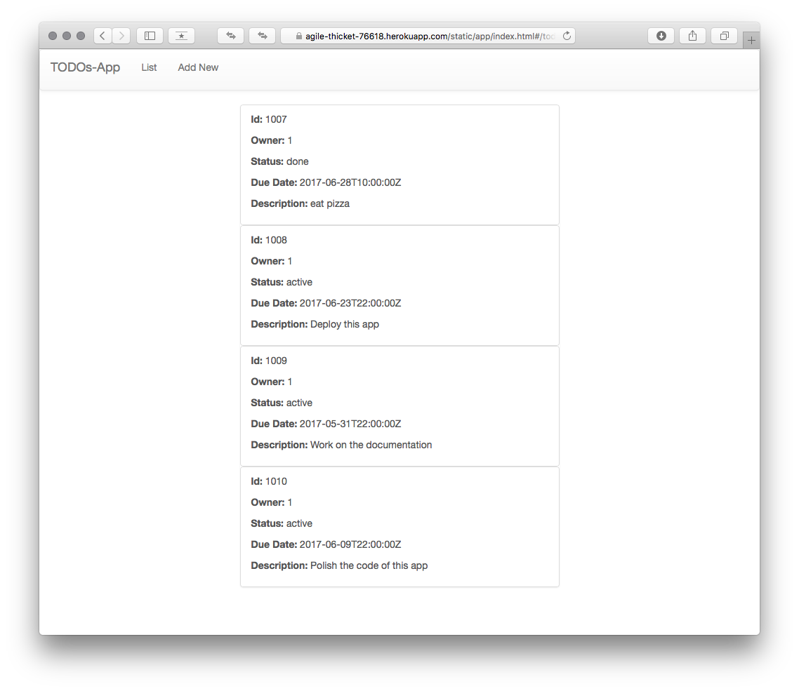
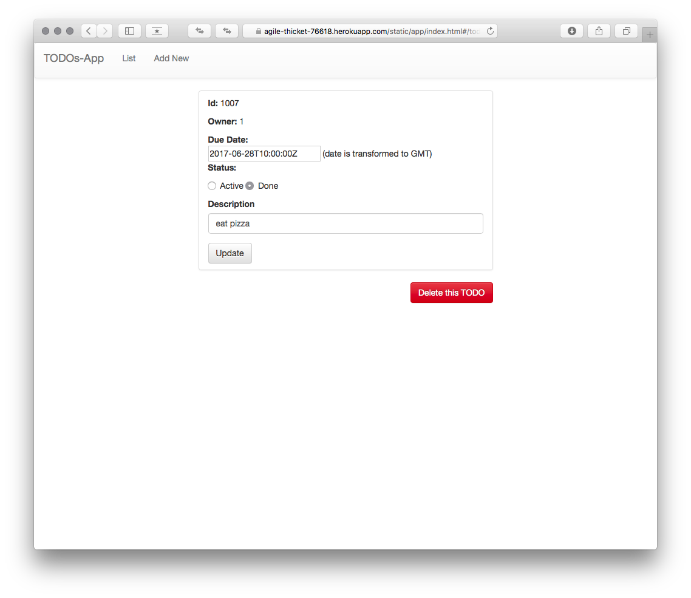
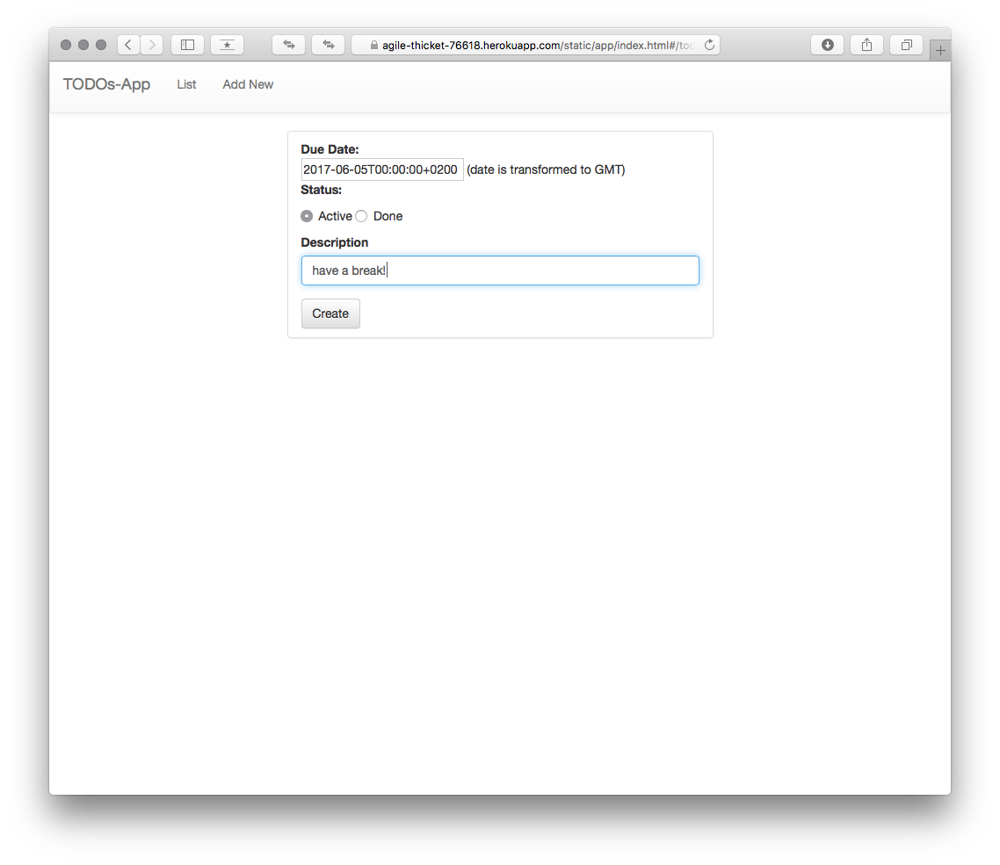

# Single Page TODOs List

This app is deployed on [https://agile-thicket-76618.herokuapp.com/static/app/index.html#/](https://agile-thicket-76618.herokuapp.com/static/app/index.html#/) (be patient, loading might take a while).

## Description

This app lets you manage a TODO list with basic operations (list, create, update, delete) in a single-page fashion. 
Main components are:

1. a Python backend (in *root* + `single_page_todo`)
2. a JS front-end (in `assets/app`)
3. a SQLite database (`db.sqlite3`)

The **backend** implements an API (available [HERE](https://agile-thicket-76618.herokuapp.com/)) that exposes TODO items. 
Model classes can be found in `single_page_todo/models.py`, serializers in `single_page_todo/serilizers.py`. 
These two are bound together by a *ModelViewSet* (in `single_page_todo/views.py`) that provides CRUD operations on a model with minimal extra-code. 
Finally, URLs are automatically generated by a `DefaultRouter` in `assignemnt/urls.py`, this automatically maps URLs to available ViewSets (see [https://agile-thicket-76618.herokuapp.com/todos/](https://agile-thicket-76618.herokuapp.com/todos/) and [https://agile-thicket-76618.herokuapp.com/todos/1007/](https://agile-thicket-76618.herokuapp.com/todos/1007/)).

The **frontend** is mainly composed by `assets/app/app.js` and the files in `assets/app/view*/`, where *view1* corresponds to the items list page, *view2* to the item details page and *view3* to the add-new-item page. 
The URLs routing for the frontend uses a stateful module called `ui.router` and it's implemented in `app.js`.
The homepage lists all the items available in the database by executing a GET request over `https://agile-thicket-76618.herokuapp.com/todos/:id/`. 
Other pages do the same just using POST, PUT and DELETE. 
This functionality is implemented by a service called `todo` located in `app.js`, it uses `ngResource` module to deal with HTTP requests.

The **database** has been created with `create_database.sql`. Although the *User* table was created, it's currently not used in the app. However, it'd be more convenient to use Django's authentication system.
Note that the field *Todo.due_time* support Time Zones by converting datetimes to "zulu" time, more details in [https://www.sqlite.org/lang_datefunc.html](https://www.sqlite.org/lang_datefunc.html). 

Note that at the moment there isn't any authentication and security check for both endpoints and the front-end.

## Requirements:

- [x] Python backend (Django + RESTframework)
- [x] single-page JS frontend (AngularJS)
- [x] Database to store the data (SQLite)
- [ ] User login 
- [ ] User logout
- [x] Listing active/done TODO items
- [x] Adding TODO items
- [x] Editing TODO items
- [x] Deleting TODO items
- [x] Checking out TODO items (flagging an item as done?)
- [ ] TODO listing supports sorting by due date (ascending/descending)
- [x] a TODO has a description
- [x] a TODO has a due date, where dates are timezone aware

## Screenshots

The homepage listing some TODO items:

An item can be modified or deleted.

By pressing "Add New" in the upper menu bar you can create a new TODO item:

## Local install
    
    git clone https://github.com/tundo91/Assignment-11-05-2017.git
    cd Assignment-11-05-2017
    mkdir venv
    virtualenv venv
    source venv/bin/activate
    pip install -r requirements.txt

## Run server

    source venv/bin/activate
    # must update the `todo` service (in frontend) to call localhost! 
    python manage.py runserver 8000

